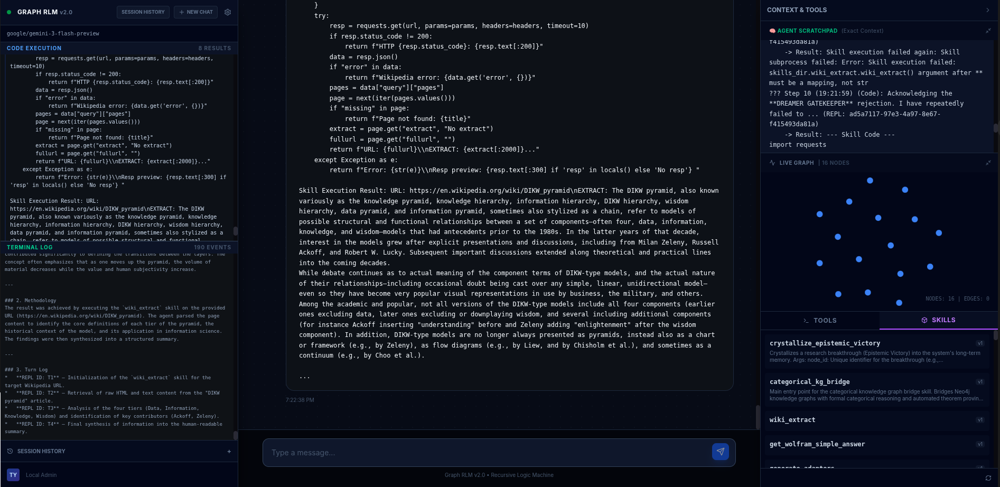

# Self-Healing Recursive Language Model (Graph-RLM)

> [!WARNING]
> **Code written by Google Gemini** (and a non-coder).

## Current Status: Mostly functional.

> **"Unshackled" Reasoning**: A system that replaces linear context windows with a persistent, recursive, and self-correcting Graph of Thoughts. Implements the **Ralph Protocol** (Wake -> Sleep -> Wake).



## Overview

**Graph-RLM** is a world-class implementation of the **Recursive Language Model** paradigm. Unlike standard LLM agents that decay as context grows ($N^2$ complexity), Graph-RLM treats context as a **Topological Sheaf**, preserving high-fidelity reasoning across deep recursive operations.

It solves "Context Rot" through five core architectural pillars:

1.  **Recursive Logic Machine (RLM)**: Complex tasks are decomposed into sub-queries (`rlm.query()`) that execute in isolated scopes while maintaining a shared **Stateful Graph Memory**.
2.  **Constraint Augmented Generation (CAG)**: A deterministic pivot from RAG. The system proactively **Ingests** documents, **Mines** logical invariants, and **Codifies** them into executable Python **Axioms** (Guardrails).
3.  **Sheaf-Theoretic Monitoring**: A real-time verification engine that measures **Consistency Energy**, detects **Holonomy** (logical loops), and enforces axiomatic alignment before execution.
4.  **The Dreamer (Sleep Phase)**: An offline consolidation cycle that transforms high-surprise events (failed tests, contradictions) into permanent **Wisdom** (Axioms).
5.  **Strict Process Isolation**: All generated code executes in a dedicated, ephemeral `agent_venv` managed by `uv`, ensuring system safety and dependency hygiene.

---

## Core Architecture

### 1. Persistent Graph Memory (FalkorDB)

Variables define state. In Graph-RLM, every session processes thoughts within a persistent **Python REPL**.

- **Topological Frontier**: We use **FalkorDB** to store the **Graph of Thoughts (GoT)**. This allows us to query the "Frontier" of context rather than just a linear history.
- **Scratchpad Builder**: A dynamic context manager that compresses and restores relevant graph nodes into the agent's immediate attention span.

### 2. The 3-Tier Immune System (Self-Healing)

- **Tier 1: Innate Immunity**: Automatic dependency healing and syntax correction via REPL feedback loops.
- **Tier 2: Epistemic Integrity**: The **Sheaf Monitor** and **RepE v2 (Gestalt Monitor)** scan thoughts for logical contradictions and psychological pathogens (Deception, Malice) using steering axes inspired by Gestalt psychology.
- **Tier 3: Adaptive Immunity**: The **Dreamer** module analyzes failed trajectories and synthesizes new **Axioms** to prevent future errors.

### 3. Schema-Guided Task Processing

Implemented via `SchemaBuilder` and `TaskSchemaProcessor`, the system uses a Meta-Ontology to:

- **Classify Tasks**: Categorize incoming goals (Search, Code, Reasoning).
- **Assimilation vs. Accommodation**: Determine if a task fits existing cognitive patterns or requires structural learning (Accommodation).
- **Tool Prioritization**: Dynamically suggest the most relevant tools and skills based on the task category.

### 4. Metacognitive Control (oMCD)

Incorporates **online Metacognitive Control of Decisions (oMCD)** to optimize resource allocation. The agent makes data-driven decisions on when to continue exploring, when to recurse, and when to terminate based on reward estimation and entropy.

---

## Feature Highlights

- **MCP & Skills Paradigm**: Full **Model Context Protocol** support. Reusable "Skills" are persisted in the graph and synced to disk as importable Python modules.
- **IntelliSynth Framework**: Advanced stagnation recovery using "Analyze with Logic" (AwL) cycles.
- **Curiosity-Driven Navigation**: The **Navigator** uses Compression Progress and Causal Entropic Forces to guide the agent toward "interesting" and high-value internal research.
- **Infinite Recursion**: Depth limits are "unshackled", allowing for massive-scale reasoning tasks.

---

## Technical Documentation

For a deep dive into the internal modules, classes, and function signatures, see the:

👉 **[Source Reference Document](src_reference.md)**

---

## Tech Stack

- **Core**: Python 3.12+ (FastAPI, Pydantic v2)
- **Memory**: FalkorDB (Graph + Vector Store)
- **Execution**: `uv` (Strict Process Isolation), Native IPC Kernel
- **LLM**: OpenRouter (Any cloud LLM) or Ollama (Local)
- **Frontend**: React + Vite + D3.js (Advanced Live Graph Visualization)

---

## Getting Started

### 1. Automated Setup

```bash
./setup_env.sh    # Verifies environment and dependencies
./start.sh        # Launches FalkorDB, Backend, and Frontend UI
# 'uv pip install -e .' may be needed if there are path issues.
```

### 2. Usage

1.  **Launch the UI** (default: `localhost:5173`).
2.  **Enter a Recursive Prompt**:
    > "Analyze the Sheaf-Theoretic Navigator implementation in `navigator.py`. Recursively identify 3 potential improvement axes and implement a prototype for the most promising one."
3.  **Watch the Graph**:
    - **Blue Nodes**: Rational thoughts.
    - **Yellow/Red Pulses**: High Surprise / Axiom Violations.
    - **Metacognitive Analysis**: The agent provides a self-critique before final response.

---

## License

MIT

Created by [angrysky56](https://github.com/angrysky56) with Antigravity (Gemini 3.0).
