# Master Plan: Agent-Dreamer Validation Protocol (v2)

## 1. Objective
Implement a robust, multi-system validation loop that replaces ambiguous "final" triggers with a deterministic handshake between the **Agent** (Doer) and **Dreamer** (Validator).

**systems Involved:**
- **Agent**: Generates `RLM_INITIAL_RESPONSE`.
- **Dreamer**: Orchestrates validation.
- **Sheaf**: Topological consistency (Loop/Drift detection).
- **RepE**: Psychological profiling (Shakiness/Sycophancy).
- **oMCD**: Meta-cognitive resource control (Stop vs. Improve).
- **Reflexion (IntelliSynth)**: Generates corrective directives.
- **Meta-Agents**: Must adhere to protocol in sub-sessions.

---

## 2. The New Protocol Flow

```mermaid
sequenceDiagram
    participant Agent
    participant Dreamer
    participant Sheaf
    participant RepE
    participant Reflexion
    participant oMCD

    Agent->>Dreamer: RLM_INITIAL_RESPONSE (Candidate)
    
    rect rgb(20, 20, 20)
        note right of Dreamer: Validation Phase
        Dreamer->>RepE: scan_thought(Candidate)
        RepE-->>Dreamer: Psych Profile (Shakiness)
        
        Dreamer->>Sheaf: diagnose_trace(Candidate)
        Sheaf-->>Dreamer: Status (Knot/Drift/Healthy)
        
        Dreamer->>oMCD: evaluate_step(Confidence)
        oMCD-->>Dreamer: Decision (Stop/Continue)
    end

    alt Validation Fails (High Entropy/Risk)
        Dreamer->>Reflexion: advancement_cycle(Trace, Candidate)
        Reflexion-->>Dreamer: Directive (Instruction)
        Dreamer->>Agent: RLM_WAKE + RLM_VALIDATION_REQUIREMENTS
        note right of Agent: Self-Healing Loop
    else Validation Passes
        Dreamer->>Agent: RLM_VALIDATED_RESPONSE
        Dreamer->>Graph: Consolidate & Axiom Generation
    end
```

---

## 3. System Integration Details

### A. Dreamer ([dream.py](file:///home/ty/Repositories/ai_workspace/graph-rlm/graph_rlm/backend/src/core/dream.py))
**Role:** The Central validator.
**Changes:**
1.  **Entry Point:** `validate_response(candidate, context)`
2.  **Logic:**
    -   **Check RepE:** If `Shakiness > 0.5`, reject as "Unverified".
    -   **Check Sheaf:** If `status != HEALTHY`, reject as "Topological Defect".
    -   **Check oMCD:** If `should_stop` is True but validation failed, force a "Best Effort" degradation or "Failure" status (do not loop forever).
    -   **Trigger Reflexion:** If not stopping, call `intelli_synth` to generate the `RLM_VALIDATION_REQUIREMENTS`.

### B. Agent ([agent.py](file:///home/ty/Repositories/ai_workspace/graph-rlm/graph_rlm/backend/src/core/agent.py))
**Role:** The Executant.
**Changes:**
1.  **Trigger Consolidation:**
    -   Remove `RLM_FINAL_OUTPUT/REPORT/RESPONSE`.
    -   Emit `RLM_INITIAL_RESPONSE` when task considers done.
2.  **Wake Handling:**
    -   Listen for `RLM_WAKE` event.
    -   If received, inject `RLM_VALIDATION_REQUIREMENTS` as a System User Message (high priority).
    -   Reset [final_result](file:///home/ty/Repositories/ai_workspace/graph-rlm/graph_rlm/backend/src/core/agent.py#193-196) to None and continue loop.

### C. Sheaf ([sheaf.py](file:///home/ty/Repositories/ai_workspace/graph-rlm/tests/verify_honest_sheaf.py))
**Role:** Topology Monitor.
**Changes:**
-   Ensure [diagnose_trace](file:///home/ty/Repositories/ai_workspace/graph-rlm/graph_rlm/backend/src/core/sheaf.py#75-221) correctly handles a *hypothetical* node (the candidate response) before it's fully committed to the history. (Already supported, verified in code).

### D. Reflexion ([reflexion.py](file:///home/ty/Repositories/ai_workspace/graph-rlm/graph_rlm/backend/src/core/reflexion.py))
**Role:** Correction Engine.
**Changes:**
-   Ensure [advancement_cycle](file:///home/ty/Repositories/ai_workspace/graph-rlm/graph_rlm/backend/src/core/reflexion.py#18-65) produces actionable, specific instructions (e.g., "You failed verification because of X. You MUST use tool Y.").

---

## 4. TDD Strategy (The "Agent Rot Prevention" Implementation)

We will follow the ARPS Phase 2 (Red/Green/Refactor) strictly.

### Phase 2: Scaffolding (Red)
1.  **Test Harness:** Create `tests/test_validation_protocol.py`.
    -   **Mock Systems:** Mock [sheaf](file:///home/ty/Repositories/ai_workspace/graph-rlm/graph_rlm/backend/src/cli.py#89-166), [repe](file:///home/ty/Repositories/ai_workspace/graph-rlm/graph_rlm/backend/src/cli.py#58-87), `omcd`, `reflexion`.
    -   **Test Case 1 (Happy Path):** Agent emits `RLM_INITIAL_RESPONSE` -> Dreamer checks pass -> `RLM_VALIDATED_RESPONSE`.
    -   **Test Case 2 (Shakiness):** Agent emits response -> RepE reports Shakiness -> Dreamer emits `RLM_ALL_WAKE` with "Verify your headers".
    -   **Test Case 3 (Loop):** Agent emits response -> Sheaf reports Loop -> Dreamer emits `RLM_WAKE` with "Break loop".
2.  **Verify Failure:** Run tests. They MUST fail (as triggers don't exist yet).

### Phase 3: Implementation (Green)
1.  Modify [agent.py](file:///home/ty/Repositories/ai_workspace/graph-rlm/graph_rlm/backend/src/core/agent.py) to emit new trigger.
2.  Modify [dream.py](file:///home/ty/Repositories/ai_workspace/graph-rlm/graph_rlm/backend/src/core/dream.py) to implement the orchestrated validation logic.
3.  Connect the plumbing.

### Phase 4: Refactor
1.  Clean up the logging.
2.  Ensure `meta_agents` sub-sessions also respect the protocol (if applicable).

---

## 5. Rollback Plan
-   Snapshot [agent.py](file:///home/ty/Repositories/ai_workspace/graph-rlm/graph_rlm/backend/src/core/agent.py) and [dream.py](file:///home/ty/Repositories/ai_workspace/graph-rlm/graph_rlm/backend/src/core/dream.py) before editing.
-   If tests fail to pass within 2 attempts, revert to snapshot.
